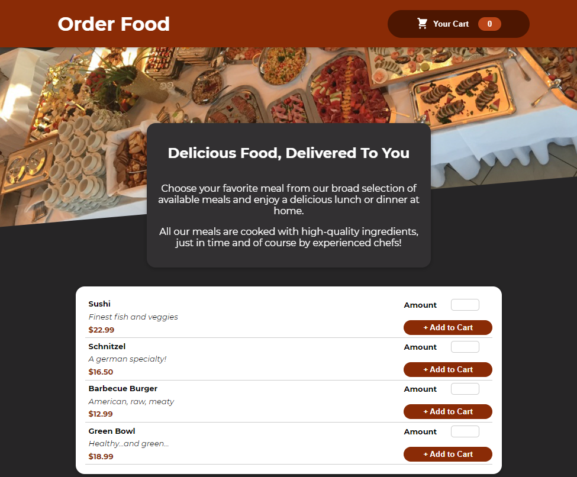
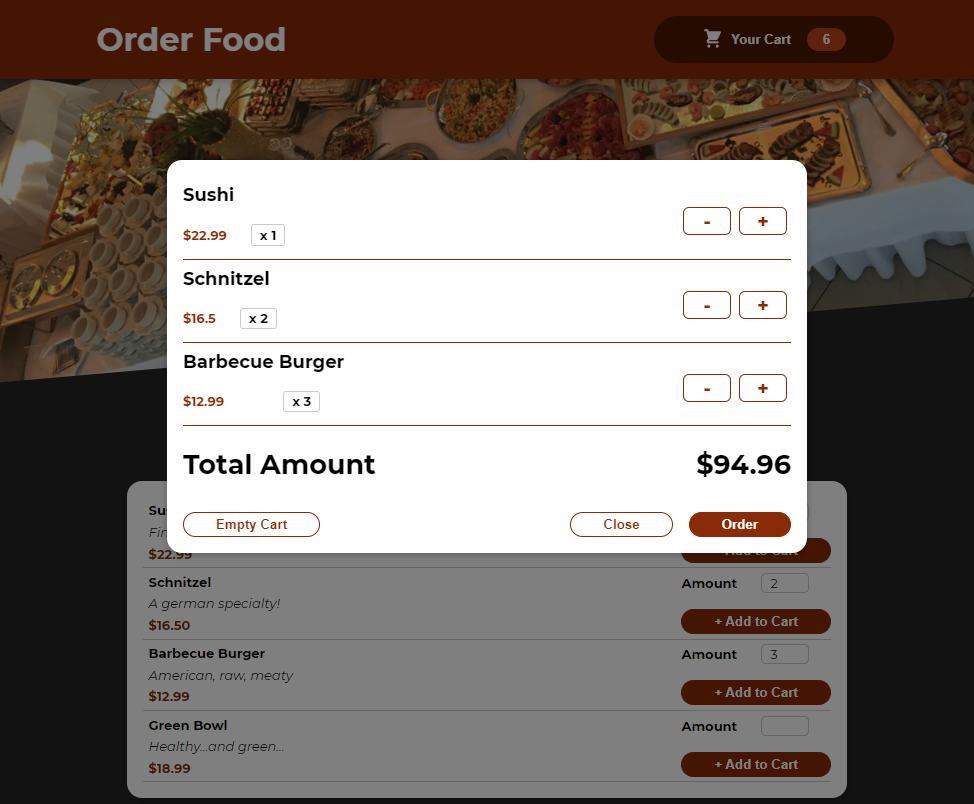
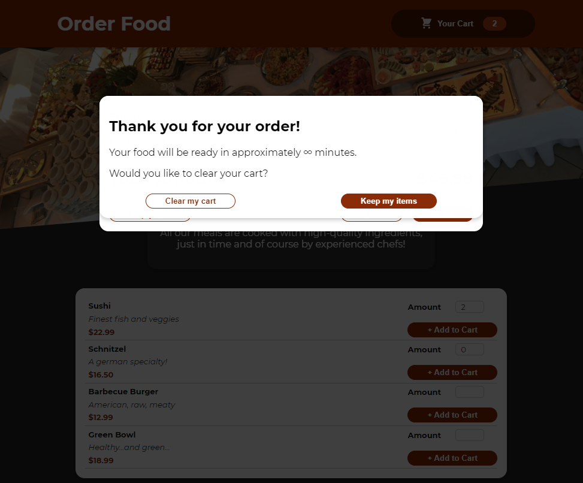
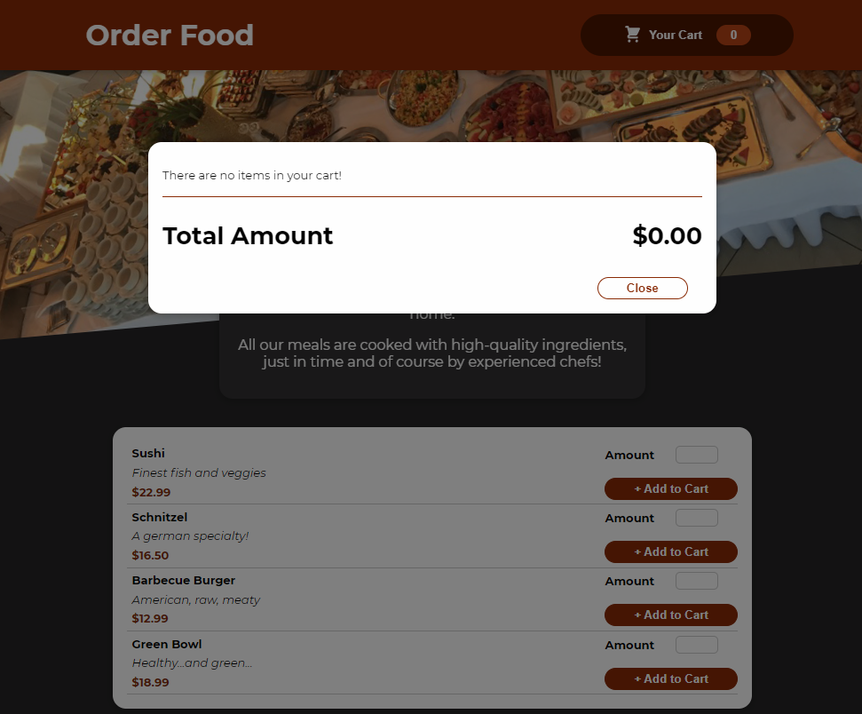
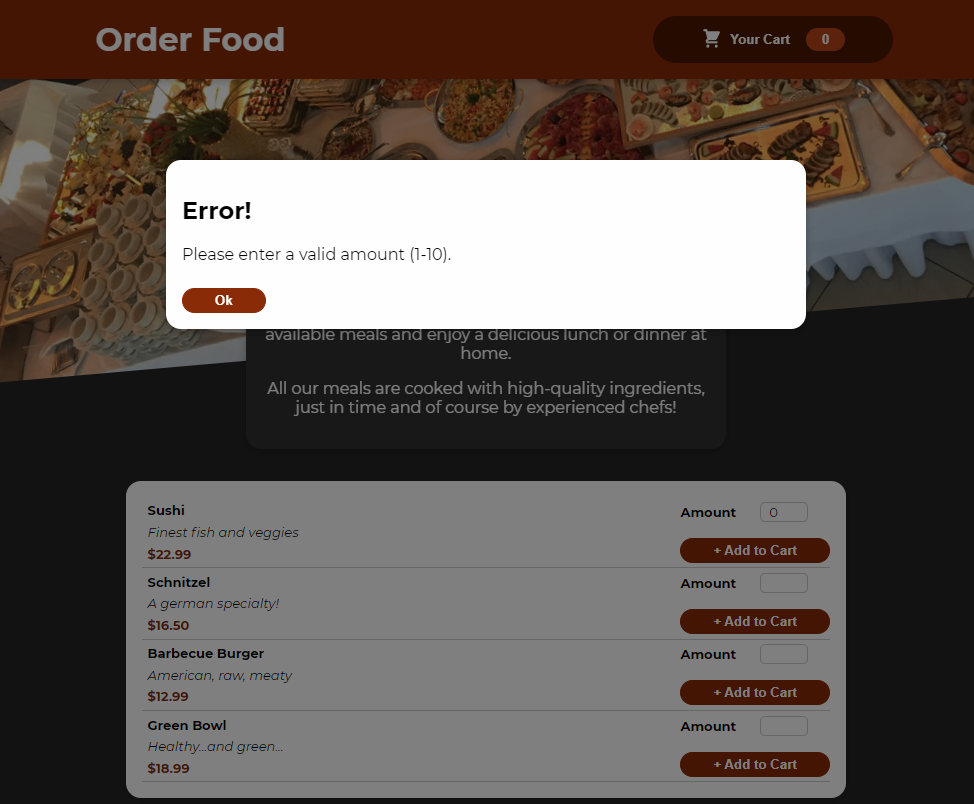

# Order Food




## Description

Order Food is a mock front end application for a restaraunt's ordering service. Customers can browse the restaraunt's menu and add items to their cart. Customers can view their cart at anytime to see all items that have been placed in the cart, and the total amount of their order. Customers can adjust the quantity of items from their cart, or choose to empty their cart alltogether. After placing their order, customers are given the option of clearing their cart contents, or leaving items in their cart for easy reordering.

* [Live Order Food Application](https://spreston4.github.io/order-food/)

* [Video demo of the Order Food application](https://watch.screencastify.com/v/izH4CPENhvxSTzTl4Y0s)

* [GitHub Repo for the Order Food application](https://github.com/spreston4/order-food)


## Table of Contents

* [Intallation](#installation)
* [Usage](#usage)
* [Technologies Used](#technologies-used)
* [Finished Product](#finished-product)
* [Contact Me](#contact-me)


## Installation

1.  Download the project to the location of your choice
2.  Navigate to the project directory
3.  From the root of the directory, install the project with the following command: 
```
npm install
```


## Usage

1. Navigate to the the project directory
2. To run locally, run the following command from the root of the directory:
```
npm start
```
3. The user is presented with the restaraunt's menu and an empty cart
4. The user can select an amount of each item and press the 'Add to Cart' button to add items to their cart
5. To view the cart, select the 'Your Cart' button in the top right corner
6. Users can adjust the amount of each item in their cart by selecting the '+' and '-' buttons next to their items
7. Users can clear their entire cart contents by selecting the 'Empty Cart' button
8. Select the 'Close' button to close the cart and continue shopping
9. Selecting the 'Order' button will display a confirmation message to the user and give them the option of clearing their cart, or keeping their items


## Technologies Used

Built in Visual Studio with:
* React.js
* JavaScript


## Finished Product

* [Live Order Food Application](https://spreston4.github.io/order-food/)

* [Video demo of the Order Food application](https://watch.screencastify.com/v/izH4CPENhvxSTzTl4Y0s)

 

 

 

 

 


## Contact Me

Questions, comments, or concerns about this project? Contact via e-mail or checkout my GitHub!

* GitHub: [spreston4](https://github.com/spreston4)

* E-mail: [sam.preston11@gmail.com](mailto:sam.preston11@gmail.com)